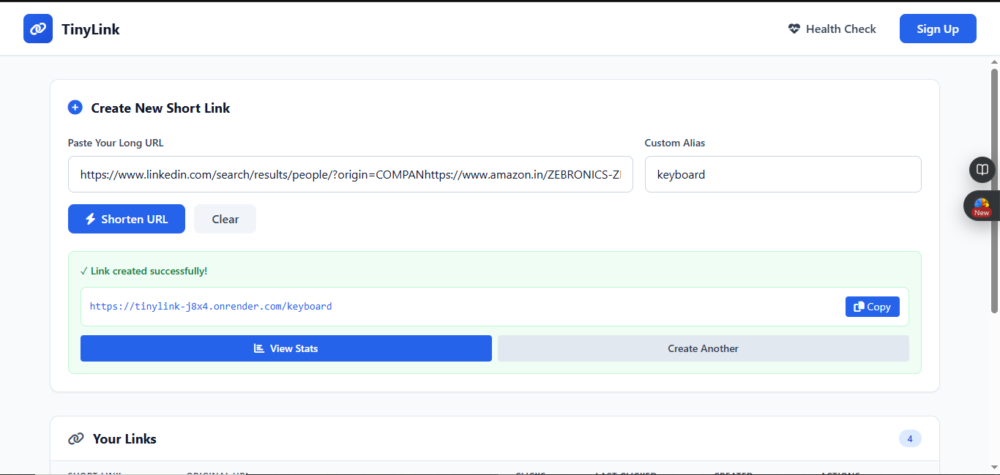
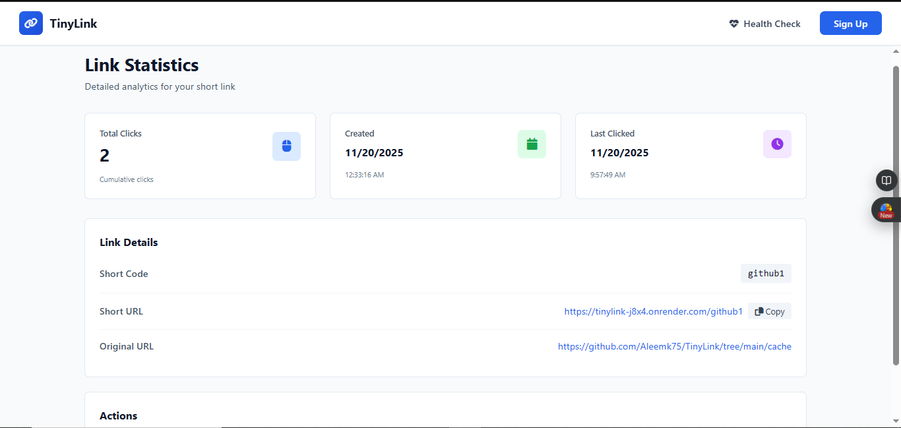

# TinyLink - URL Shortener

A professional URL shortening application similar to Bitly, built with Node.js, Express, MongoDB, and Upstash Redis. Features real-time click tracking, custom short codes, and a modern responsive UI.

---

## ⚠️ Security Notice

This is an educational/portfolio project deployed on free hosting. Some browsers may show security warnings due to:
- Shared IP addresses on free hosting platforms
- Google Safe Browsing's conservative approach to URL shorteners
- Low domain reputation for new deployments

This is a **false positive**. The application:
- Only shortens user-provided URLs
- Does not host malicious content
- Implements input validation
- Is regularly monitored for security

If you see a warning, you can safely proceed as this is a legitimate portfolio project.

---

## ✨ Features

✅ **Create Short Links** - Generate shortened URLs with auto-generated 6-8 alphanumeric codes or custom codes  
✅ **Click Tracking** - Real-time click count and last clicked timestamp  
✅ **Custom Codes** - Create personalized short codes (6-8 characters)  
✅ **Link Management** - View all links in a clean table or delete links anytime  
✅ **Statistics Dashboard** - Detailed analytics page for each link with live updates  
✅ **Auto-Refresh Stats** - Stats update automatically without page refresh  
✅ **Responsive UI** - Modern Tailwind CSS design with smooth animations  
✅ **Fast Redirects** - 302 redirects with Redis caching for performance  
✅ **URL Validation** - Proper URL format validation using JavaScript's URL constructor  
✅ **Health Check** - System status endpoint showing database and Redis connection status  
✅ **Duplicate Detection** - Returns 409 Conflict for duplicate custom codes  

---

## 🖼️ Screenshots

### 1️⃣ Dashboard - Create & Manage Short Links
The main dashboard where users can create new short links and view all their created URLs in a beautiful table with statistics.

**Features shown:**
- Create form with URL input and optional custom code
- Real-time short URL display with copy button
- Links table with all metadata (clicks, dates, actions)
- Responsive design for mobile and desktop


---

### 2️⃣ Success Display - URL Created
After successfully creating a short link, the app displays the generated URL with quick action buttons.

**Features shown:**
- Generated short URL with copy button
- View Stats button to see analytics
- Create Another button to generate more links
- Success notification



---

### 3️⃣ Statistics Page - Track Link Performance
Detailed analytics page showing comprehensive stats for each individual short link.

**Features shown:**
- Total clicks counter with icon
- Creation date and time
- Last clicked timestamp with time
- Short code and short URL with copy button
- Original URL display
- Delete link option
- Auto-refresh every 2 seconds (no manual refresh needed)


---

### 4️⃣ 404 Page - Link Not Found
Clean and informative 404 page displayed when a link doesn't exist or has been deleted.

**Features shown:**
- Animated broken link icon
- Clear error message
- Back to Dashboard button
- Create New Link button
- Helpful information card


---

### 5️⃣ Navbar & Navigation
Professional navbar with TinyLink branding and navigation options.

**Features shown:**
- TinyLink logo (clickable, redirects to dashboard)
- Health Check button to verify system status
- Sign Up button for future authentication
- Responsive design


---

### 6️⃣ Links Table - All Created URLs
Comprehensive table showing all shortened links with detailed information and action buttons.

**Columns:**
- Short Link (with icon)
- Original URL
- Clicks count
- Last Clicked date
- Created date
- Actions (Copy, Stats, Delete)


---


- **Backend:** Node.js + Express.js
- **Database:** MongoDB with Mongoose ODM
- **Caching:** Upstash Redis (REST API)
- **Frontend:** EJS templates + Tailwind CSS 4.0
- **Icons:** Font Awesome 6.4.0
- **Development:** Nodemon

---

## 📋 API Endpoints

### Create Short URL
```bash
POST /api/links
Content-Type: application/json

{
  "url": "https://example.com/very/long/url",
  "customCode": "mycode"  // Optional, 6-8 alphanumeric characters
}
```

**Responses:**
- `201 Created` - Link created successfully
- `200 OK` - Existing URL returned (if no custom code)
- `400 Bad Request` - Invalid URL or code format
- `409 Conflict` - Custom code already exists

### Get All Links
```bash
GET /api/links
```

### Get Link Stats
```bash
GET /api/links/:code
```

### Delete Link
```bash
DELETE /api/links/:code
```

### Redirect to Original URL
```bash
GET /:code
```
Returns: `302 Found` redirect to original URL

### Health Check
```bash
GET /healthz
```

Returns system status (database and Redis connection status)

---

## 🚀 Installation & Setup

### 1. Clone the Repository
```bash
git clone https://github.com/Aleemk75/URLite.git
cd URLite
```

### 2. Install Dependencies
```bash
npm install
```

### 3. Set Up Environment Variables
Create a `.env` file in the root directory:

```dotenv
PORT=8001
BASE_URL=http://localhost:8001

MONGO_URI=mongodb+srv://<username>:<password>@<cluster>.mongodb.net/?appName=<app-name>

UPSTASH_REDIS_REST_URL=https://<your-upstash-instance>.upstash.io
UPSTASH_REDIS_REST_TOKEN=<your-upstash-token>
```

### 4. Get Upstash Redis Credentials
1. Go to [Upstash Console](https://console.upstash.io)
2. Create a new Redis database
3. Copy the REST URL and REST Token
4. Paste them in your `.env` file

### 5. Run the Application

**Development:**
```bash
npm run dev
```

**Production:**
```bash
node index.js
```

The app will start at 👉 **http://localhost:8001**

---

## 📊 Database Schema

### URL Document
```javascript
{
  code: String,           // 6-8 alphanumeric short code
  url: String,           // Original long URL
  clicks: Number,        // Total click count
  lastClicked: Date,     // Timestamp of last click
  createdAt: Date        // Creation timestamp
}
```

---

## 🔄 Caching Strategy

- **Redis TTL:** 1 day (86,400 seconds)
- **Cache Keys:** Both code and URL are cached separately
- **Auto-Update:** Cache is refreshed whenever clicks are recorded
- **Fallback:** If Redis is unavailable, app falls back to direct database queries

---

## 📱 UI Features

### Dashboard
- Form to create new short links
- Real-time URL display with copy button
- Table showing all created links with columns:
  - Short code
  - Original URL
  - Click count
  - Last clicked date
  - Created date
  - Action buttons (Copy, Stats, Delete)

### Stats Page
- Total clicks counter
- Creation date
- Last clicked timestamp
- Short URL with copy button
- Original URL
- Delete link option
- Auto-refresh every 2 seconds

### 404 Page
- Animated icon
- Helpful message
- Navigation buttons
- Information card

---

## ✅ Testing the API

### Create a Short Link
```bash
curl -X POST http://localhost:8001/api/links \
  -H "Content-Type: application/json" \
  -d '{"url":"https://www.example.com"}'
```

### Redirect (Test in browser)
```
http://localhost:8001/abc123
```

### Check Health
```bash
curl http://localhost:8001/healthz
```

---

## 📝 Code Validation Rules

- **Custom Codes:** Must be exactly 6-8 alphanumeric characters `[A-Za-z0-9]{6,8}`
- **URLs:** Must be valid using JavaScript's `new URL()` constructor
- **Duplicate Codes:** Return 409 Conflict status
- **Missing Links:** Return 404 Not Found

---

## 🌐 Deployment

When deploying to production:

1. Update `BASE_URL` in `.env` to your production domain:
   ```dotenv
   BASE_URL=https://your-production-domain.com
   ```

2. Update MongoDB connection string for production database

3. Use production Upstash Redis instance

4. Set `NODE_ENV=production`

---

## 👤 Author

**Aleem Khan**  
[LinkedIn](https://www.linkedin.com/in/aleemkh4n/)

---

## 📄 License

ISC

---

## ⭐ Support

If you like this project, don't forget to star the repo and share it with others!


